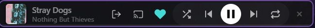
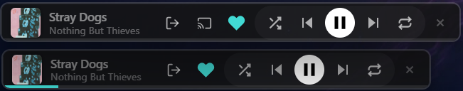

# Spotify Taskbar Widget

  

  
  
  

---

A premium, ultra-slim (40px) Spotify mini-player designed for native desktop integration. Compatible with Windows 11, macOS, and Linux, this widget integrates into your Taskbar or Menu Bar for seamless playback control.

## Performance Comparison

| Feature | Official Spotify App | Spotify Taskbar Widget |
| :--- | :---: | :---: |
| RAM Usage | ~500MB - 1GB+ | **~50MB - 80MB** |
| Footprint | Full Window | **Ultra-Slim 40px** |
| Tech Stack | Electron | **Tauri + Rust** |
| System Impact | High | **Minimal** |
| Integration | Standard Window | **Native Desktop Module** |

## Screenshots

  
   
  <em>Integrated into the Windows 11 taskbar.</em>

  
   
  <em>Dynamic accent colors, polished interface, and one-click device switching.</em>

## What's New: Device Switching

The widget now has a dedicated cast icon for jumping between Spotify Connect devices (phone, speakers, another computer) without leaving the taskbar. The panel before this update had no way to do this — you can see the extra icon added to the action row below:

  
   
  <em>New (top): device switcher icon added next to Force Reconnect. Previous version (bottom): no way to switch devices from the widget.</em>

## What's New: Playlists, Search & a Flexible Layout

Beyond switching devices, the widget can now browse and search your library directly:

- **Playlists panel**: A dedicated icon opens your Spotify playlists. Click one to start playing it, or use the arrow on a row to open that playlist and jump straight to a specific song.
- **Liked Songs**: Pinned at the top of the playlist list for one-click access to your saved tracks, with the same browse-to-a-song support.
- **Search**: A search box at the top of the playlist panel finds any song in your Spotify catalog and plays it instantly. Playback doesn't just stop when the song ends either — a handful of tracks from the same artist are queued up afterward.
- **Redesigned device switcher**: The device list is now a floating popup anchored to its icon, opening above the player bar instead of pushing it around.
- **Adjustable layout**: A thin drag handle between the track title and the buttons lets you trade horizontal space between them — more room for long titles, or full-size buttons — without resizing the window itself. Your preference is remembered between sessions.

## Key Features
- **Precision Fit**: Specifically calibrated 40px height for the Windows 11 taskbar.
- **Cross-Platform**: Intelligent positioning for Windows, macOS, and Linux.
- **Dynamic Theming**: Automatic color extraction from album art for visual integration.
- **Device Switching**: Move playback between your phone, speakers, or another computer directly from the widget.
- **Playlists & Search**: Browse your playlists (Liked Songs included), search your Spotify library for a specific song, and jump straight into playback.
- **Adjustable Layout**: Drag a small handle to trade space between the track title and the control buttons to fit your preference.
- **High Performance**: Built with Rust for immediate responsiveness and low resource overhead.
- **Background Operation**: Runs in the system tray to maintain a clean workspace.
- **System Integration**: Global media keys (Play/Pause, Next, Previous), auto-focus on hover, and OS-level secure credential storage.

## Technical Overview
The widget serves as a high-performance remote bridge for your Spotify account. It operates as a standalone application and **does not require the official Spotify desktop client to be open**. 

Utilizing the official Spotify Web API, it synchronizes playback across all your connected devices (mobile, smart speakers, or web player) while consuming significantly fewer resources than the standard desktop client.

## Installation
1. Visit the [Releases](https://github.com/MadalinaCarcea221989/Spotify-Taskbar-Widget/releases) page.
2. Download the installer for your operating system:
   - Windows: .exe or .msi
   - macOS: .dmg
   - Linux: .deb
3. Launch the application and authenticate with your Spotify account.

## Tech Stack

  
  
  
  

## License
This project is licensed under the MIT License. See the LICENSE file for more information.

---

  Built for performance and desktop efficiency.

